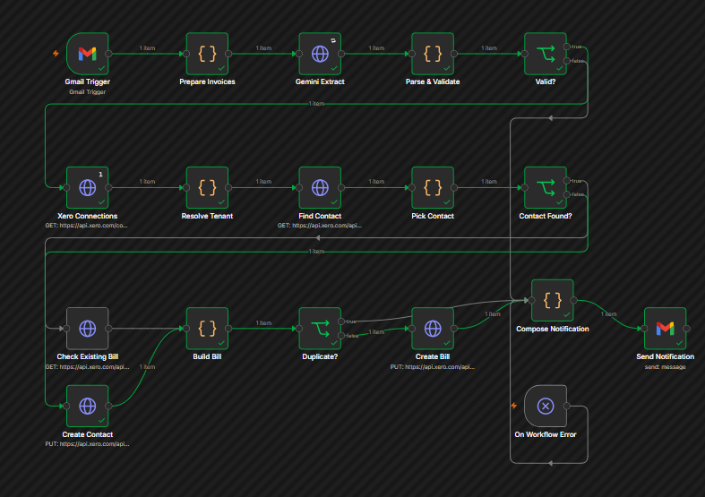
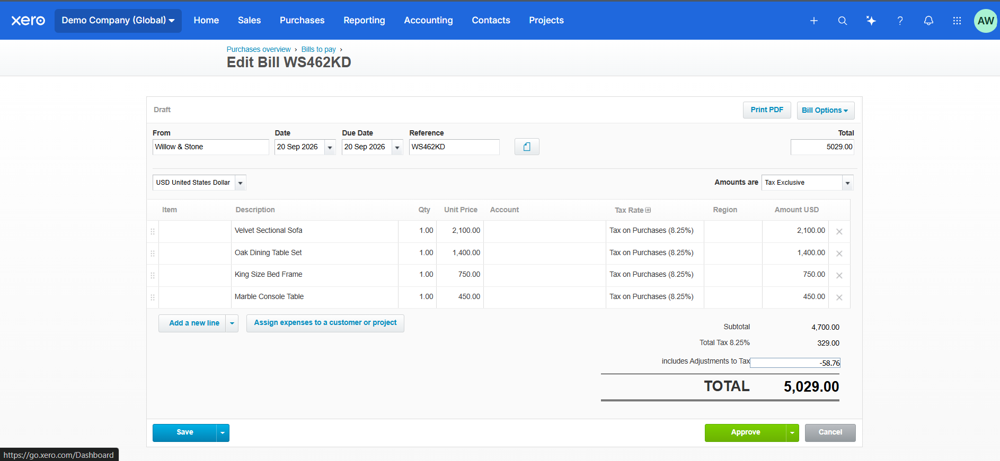
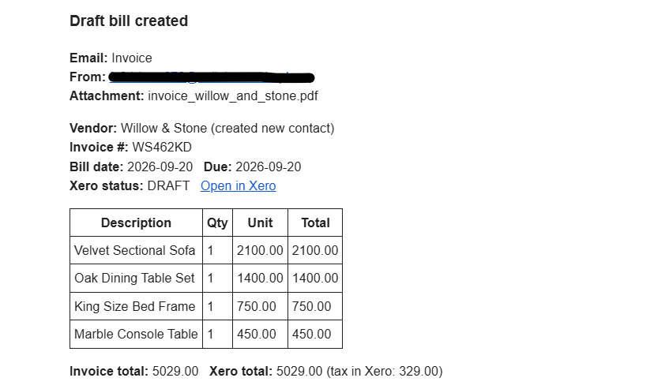
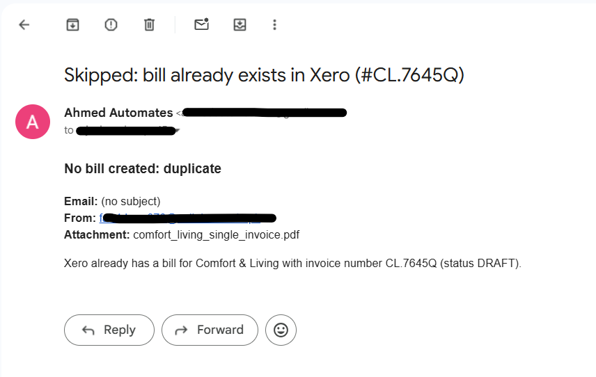
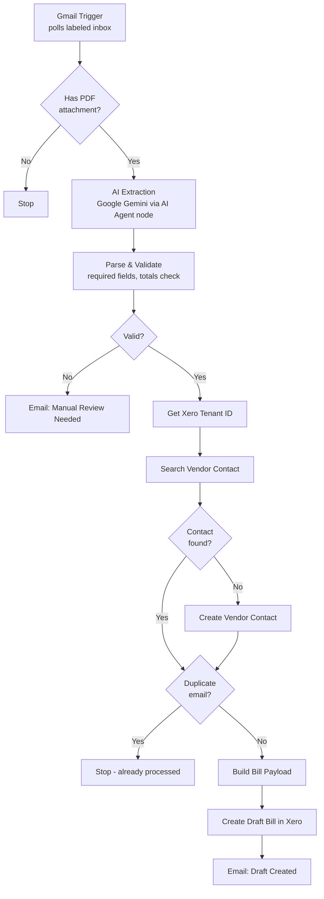

# Gmail to Xero Invoice Automation

An **n8n workflow that turns vendor invoice emails into ready-to-review draft Bills in Xero** — automatically, using AI-based document extraction instead of brittle template matching.

When a vendor emails an invoice, this workflow reads the PDF (any layout, any vendor, even scanned/image-only PDFs with no text layer), pulls out the vendor, line items, dates, and totals, matches or creates the vendor as a Xero Contact, and creates a **Draft Bill** — never auto-approved — ready for a human to check in seconds instead of typing it in from scratch.

n8n • Gmail API • Xero API • Google Gemini (AI extraction)

### n8n Workflow

### Xero Draft Bills

The workflow creates vendor bills in Xero as **Draft** records, allowing them to be reviewed before approval.

### Gmail Notifications

### Duplicate Prevention

## Overview

| | |
|---|---|
| **What it is** | An n8n automation that reads incoming vendor invoice emails and creates matching Draft Bills in Xero, without manual data entry. |
| **Who it's for** | Small business owners, freelancers, and finance teams who receive vendor invoices by email and currently retype them into Xero by hand. |
| **Problem it solves** | Manual invoice entry is slow and error-prone, and vendor invoice layouts vary too much for simple rule-based (regex/template) parsing to handle reliably. |
| **What makes it different** | AI-based extraction reads *any* invoice layout, including scanned/image-only PDFs — and every result lands as a **draft**, never auto-approved, so a human always makes the final call. |

## How it works

A vendor invoice email arrives → the workflow reads the PDF with AI → validates what it found → finds or creates the vendor in Xero → creates a draft Bill → emails you a summary. No step silently guesses when it isn't confident — anything that fails validation gets routed to you for a manual look instead of being pushed into your books.

## Why AI extraction instead of regex/templates

Vendor invoices arrive in unpredictable, inconsistent layouts — different label wording, different table structures, and in some cases no embedded text layer at all (a PDF that's really just a full-page image, verified directly by running text extraction against a real sample and getting back nothing). A fixed rule that looks for "Invoice #:" in a specific position breaks the moment a new vendor's format differs even slightly, and needs constant hand-maintenance as new vendors appear.

AI-based extraction reads for *meaning*, not position — so a new, never-seen-before vendor layout works the first time, with no new rule to write. This workflow uses Google Gemini specifically because its multimodal input reads text-based **and** image-only PDFs identically, through n8n's native AI Agent node.

## Features

### Invoice ingestion and extraction
- Polls a labeled Gmail inbox on a schedule — only emails you've routed there are ever processed.
- Skips emails with no PDF attachment before any AI call is made.
- Extracts vendor name, vendor email, invoice number, invoice date, due date, line items (description, quantity, unit price, total), subtotal, tax, total payable, and payment method as structured JSON.

### Validation before anything touches Xero
- Confirms required fields are present (vendor name, invoice number, at least one line item).
- Cross-checks that line items plus tax reconcile with the stated total, catching likely misreads.
- Anything that fails validation is routed to a manual-review email instead of creating a Bill — the workflow never guesses its way into your accounting records.

### Xero integration
- Finds an existing vendor Contact by email (falling back to name) before creating a new one, so repeat vendors are never duplicated.
- Auto-creates new vendor Contacts on first invoice, with no manual pre-setup required.
- Creates Bills as `Status: DRAFT` only — nothing is ever auto-authorised. A human always reviews before it hits the ledger.
- No chart-of-accounts mapping required at creation — account codes are assigned at review time, same as they would be manually.

### Reliability
- Duplicate-email check prevents the same invoice from creating two Bills on a retry or re-run.
- Sensible fallbacks for missing data — e.g. a missing due date defaults to same-day for Cash-on-Delivery invoices, rather than leaving the Bill incomplete.
- A dedicated error-handling path catches genuine failures (expired credentials, API outages) instead of letting them fail silently.

### Notifications
- Every run ends with an email either way: a summary of what was drafted, or exactly what needs manual attention and why.

## Edge cases and how they're handled

| Situation | Behavior |
|---|---|
| Email has no PDF attached | Skipped before any processing |
| Vendor uses a layout never seen before | Handled — AI reads by meaning, not fixed position |
| Invoice is a scanned/image-only PDF with no text layer | Handled — Gemini reads it visually |
| Invoice date or due date missing | Falls back to a sensible default (today's date; same-day due for COD) |
| AI misreads a figure and totals don't reconcile | Caught by validation, routed to manual review |
| First invoice from a brand-new vendor | Vendor Contact is created automatically in Xero |
| Same email processed more than once | Duplicate check blocks a second Bill from being created |
| Xero/Gmail outage or expired credential | Caught by the error-handling path, not swallowed silently |

## Roadmap

- **Sales Invoice (ACCREC) branch** — drafting outbound invoices from "please bill this client" request emails, once real sample data is available to design extraction against (these are freeform text with no fixed template, unlike vendor invoices).
- Optional PDF attachment on the created Bill/Invoice for audit trail (`accounting.attachments` scope).
- Support for multiple connected Xero organisations (currently uses the first connected tenant).

## Tech stack

| Technology | Purpose |
|---|---|
| n8n | Workflow orchestration and scheduling |
| Gmail API (OAuth2) | Inbox polling, attachment retrieval, notification emails |
| Xero API (OAuth2, granular scopes) | Contact lookup/creation, Bill creation |
| Google Gemini (via n8n AI Agent node) | Multimodal invoice document extraction |

## Xero API scopes used

This project uses Xero's current **granular scopes** model (the broad `accounting.transactions` scope is deprecated):

- `accounting.contacts` / `accounting.contacts.read`
- `accounting.invoices` / `accounting.invoices.read` — covers both Bills (`ACCPAY`) and Sales Invoices (`ACCREC`), since Xero exposes both through the same `/Invoices` endpoint
- `offline_access` — required for the connection to refresh automatically

## Getting started

### Prerequisites
- An n8n instance (self-hosted or cloud)
- A Xero account with an app registered in the [Xero Developer Portal](https://developer.xero.com)
- A Gmail account with a dedicated label (e.g. "Invoices") routed via a Gmail filter
- A Google AI (Gemini) API key from Google AI Studio

### Setup
1. Import the workflow JSON into n8n (Workflows → Import from File).
2. Connect your Gmail OAuth2 credential.
3. Register a Xero app, enable the scopes listed above, and connect the Xero OAuth2 credential.
4. Add your Gemini API key credential for the AI Agent node.
5. Point the Gmail Trigger node at your invoice label.
6. Run once manually against a real sample invoice to confirm the draft lands correctly in Xero before activating the schedule.

## Design principles

- **Fail toward a human, never toward a guess.** Anything the workflow isn't confident about is routed to a manual-review email rather than being written into Xero.
- **Draft-only, always.** No Bill is ever created as authorised — final approval is always a manual step.
- **No new rule per vendor.** AI-based extraction is used specifically because vendor invoice formats are unpredictable; the alternative (regex/template matching) would require ongoing manual maintenance per vendor.

## FAQ

**Does this automatically pay or approve invoices in Xero?**
No. Every record is created with `Status: DRAFT`. Nothing is authorised, paid, or posted to your ledger without a human reviewing it in Xero first.

**What happens if the invoice PDF is a scanned image instead of a text document?**
It still works. The AI extraction step reads the document visually rather than relying on a text layer, so scanned or image-only PDFs are handled the same way as regular text-based PDFs.

**What if a vendor's invoice is missing a due date?**
The workflow falls back to a sensible default — the invoice date if available, or the day the invoice was created if the payment method is Cash on Delivery — rather than leaving the record incomplete.

**Can this workflow also create invoices for clients I need to bill?**
Not yet — that direction (Sales Invoices) is on the roadmap, pending real sample data, since those requests tend to be freeform emails without a fixed template.

## License

License information will be added when the project is formally licensed.
